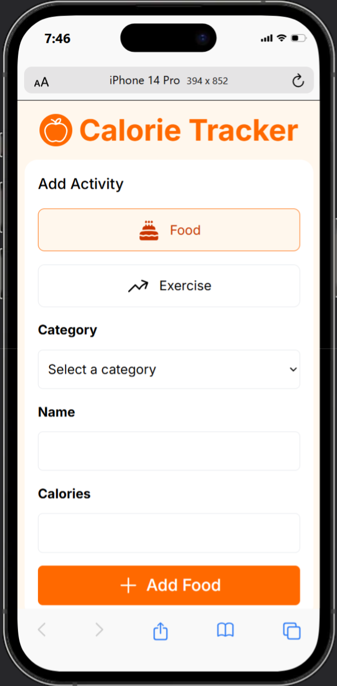
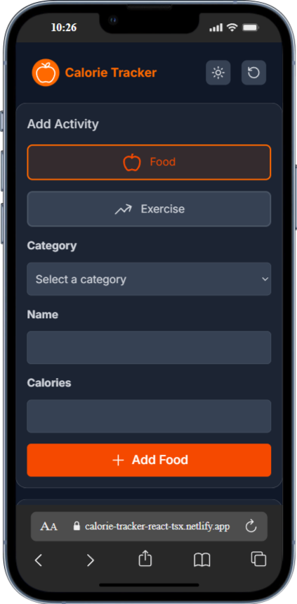

# 🥗 Calculadora de Calorías
Una aplicación web desarrollada con **React **y **TypeScript** que permite llevar un registro diario de calorías consumidas y quemadas mediante alimentos y ejercicios. Diseñada con enfoque en usabilidad, accesibilidad y una experiencia visual moderna.

## 🚀 Características principales
- ✅ Registro de alimentos con su cantidad de calorías.

- ✅ Registro de ejercicios con calorías quemadas.

- ✅ Paneles separados para calorías consumidas y calorías quemadas.

- ✅ Resumen del balance calórico diario.

- ✅ Modal de edición de actividades con efecto glassmorphism en modo claro y oscuro.

- ✅ Navbar fija con efecto glassmorphism, accesible en mobile y desktop.

- ✅ Soporte completo para modo oscuro.

- ✅ Diseño responsive adaptado a múltiples dispositivos.

- ✅ Validaciones para evitar datos incorrectos (nombres sin números, calorías positivas, etc.).

- ✅ Notificaciones interactivas con react-hot-toast.

- ✅ Transiciones suaves y feedback visual para mejorar la experiencia del usuario.

## 🧩 Tecnologías utilizadas
- ⚛️ React — Librería principal para construir la interfaz.

- 🟦 TypeScript — Tipado estático para mayor seguridad y claridad.

- 🎨 Tailwind CSS — Estilos utilitarios para diseño moderno y responsivo.

- 🔔 react-hot-toast — Sistema de notificaciones.

- 🧠 Headless UI — Componente modal accesible y personalizable.

## 🖼️ Diseño visual
- 📱**Responsive:** Adaptado para pantallas móviles, tablets y escritorio.

- 🌗 **Modo oscuro:** Activable desde la interfaz, con estilos adaptados.

- 🧊**Glassmorphism:** Aplicado en el navbar y en el modal de edición, tanto en modo claro como oscuro.

- 📌 **Navbar sticky:** Siempre visible para facilitar la navegación y el acceso a funciones clave.

## 🧪 Validaciones implementadas
- 🔒 El campo de nombre no permite números ni cadenas vacías.

- 🔒 El campo de calorías solo acepta valores positivos.

- 🔒 Se bloquea el pegado de contenido inválido en los inputs.

- 🔒 Validación final antes de enviar para evitar registros incorrectos.

##   Vista previa

## 🌐 Usa la app
👉 [Calorie-Tracker-Web](http://https://calorie-tracker-react-tsx.netlify.app/ "Calorie-Tracker-Web")

